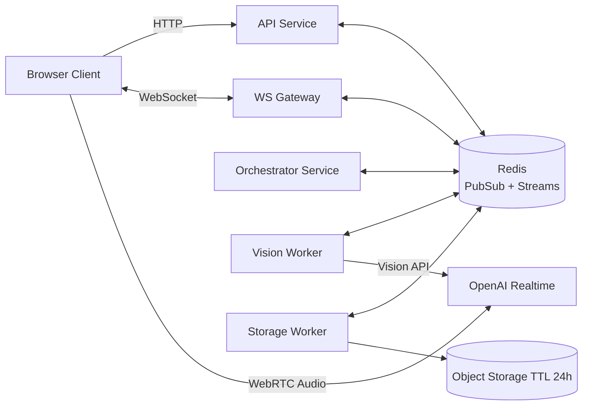
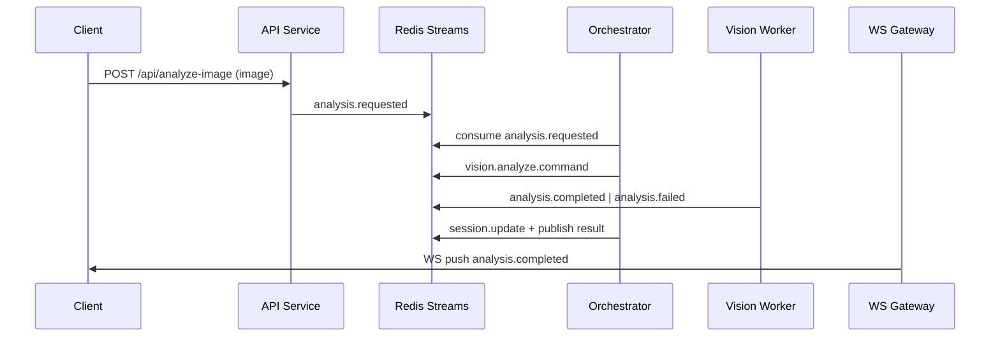

# GardenAI Backend Architecture Plan (MVP)

## 1) Summary
Целевая модель: **Hybrid orchestration**
- Клиент: лёгкий UX-оркестратор (локальные реакции, сбор медиа, UI-state).
- Backend: главный оркестратор workflow и источник истины по состоянию сессии.
- Аудио realtime: **direct-to-OpenAI (WebRTC)**, backend не проксирует медиапоток.
- Backend bus: **Redis Pub/Sub + Redis Streams**.
- Доставка в клиент: **WebSocket**.
- Гарантия: **at-least-once + idempotency** (dedupe по `messageId`).
- Retention: 24 часа для изображений и event metadata.

## 2) Backend Subsystems

### API Service (`server/api`)
Ответственность:
- `GET /api/realtime-token` — mint ephemeral token через `OPENAI_API_KEY`.
- `POST /api/analyze-image` — приём файла, первичная валидация, публикация `analysis.requested`.
- `POST /api/events` — входные доменные события от клиента (`capture.requested`, `image.uploaded`, `user.intent`).
- WebSocket gateway — подписка клиента на stream сессии (`sessionId` room), отправка статусов/результатов.

### Orchestrator Service (`server/orchestrator`)
Ответственность:
- Читает Redis Streams (consumer group), ведёт state machine сессии.
- Коррелирует аудио/текст/изображение через `sessionId`, `seq`, `causationId`, `correlationId`.
- Публикует команды воркерам (`vision.analyze.command`), обрабатывает retry/backoff.
- Решает, когда просить пересъёмку (низкая уверенность, плохое качество).

### Vision Worker (`server/workers/vision`)
Ответственность:
- Читает `vision.analyze.command`.
- Вызывает OpenAI Vision.
- Нормализует результат в контракт `analysis.completed`.
- Пишет ошибки в `analysis.failed` + DLQ при исчерпании retry.

### Storage/Retention Worker (`server/workers/storage`)
Ответственность:
- Сохраняет изображения (S3/совместимый storage), TTL 24h.
- Очистка просроченных объектов и event metadata.
- Отдаёт временные ссылки при необходимости (presigned URL, short-lived).

### Redis (Bus + Reliability)
- Pub/Sub: low-latency fanout для live уведомлений.
- Streams: надёжная обработка задач и replay.
- Consumer groups: масштабирование воркеров без потери событий.

## 3) Event Contracts and Channels

### 3.1 Canonical Event Envelope
```json
{
  "messageId": "uuid-v7",
  "type": "analysis.requested",
  "sessionId": "s_123",
  "userId": "u_42",
  "seq": 1012,
  "tsMonotonicMs": 4839201,
  "tsWallIso": "2026-04-06T10:30:12.123Z",
  "correlationId": "corr_abc",
  "causationId": "msg_prev",
  "schemaVersion": "1.0",
  "payload": {}
}
```

### 3.2 Redis Topology (MVP)
- Streams:
  - `stream:session-events` — входящие доменные события.
  - `stream:vision-commands` — команды vision worker.
  - `stream:analysis-results` — результаты/ошибки анализа.
  - `stream:dlq` — неуспешные после retry.
- Pub/Sub channels:
  - `chan:session:{sessionId}` — push статусов в WS gateway.
  - `chan:ops:alerts` — технические алерты.

### 3.3 Core Event Types
- From client/API:
  - `capture.requested`
  - `image.uploaded`
  - `analysis.requested`
  - `user.intent.detected`
- Internal commands:
  - `vision.analyze.command`
  - `storage.persist.command`
- Results:
  - `analysis.completed`
  - `analysis.failed`
  - `capture.retry.suggested`
- Reliability:
  - `event.acknowledged`
  - `event.dead_lettered`

### 3.4 Idempotency and Retry Policy
- Dedup key: `messageId` (Redis SET с TTL 24h).
- Retry: exponential backoff `300ms, 1s, 2.5s`.
- Max attempts: `3`, потом в `stream:dlq`.
- Side effects (вызовы внешнего API) только после idempotency check.

## 4) API Contracts (Public)

### `GET /api/realtime-token`
Response:
```json
{
  "token": "ephemeral_xxx",
  "expiresIn": 60,
  "sessionId": "s_123"
}
```

### `POST /api/analyze-image` (multipart: `image`)
Response:
```json
{
  "imageId": "img_001",
  "species": "Tomato",
  "confidence": 0.87,
  "diagnoses": ["possible early blight"],
  "suggestions": ["remove affected leaves", "avoid overhead watering"],
  "urgency": "medium",
  "disclaimer": "Это не медицинская/агрономическая экспертиза."
}
```

### `POST /api/events`
- Принимает canonical envelope.
- Возвращает `202 Accepted` + `messageId`.

### `WS /ws?sessionId=...`
Сервер пушит:
- `analysis.progress`
- `analysis.completed`
- `analysis.failed`
- `capture.retry.suggested`

## 5) Mermaid Diagrams

### 5.1 Component Diagram


### 5.2 Sequence: Image Analysis Orchestration


### 5.3 Event Reliability Flow
```mermaid
flowchart TD
    E[Incoming Event] --> D{messageId seen?}
    D -- Yes --> ACK1[ACK (dedup)]
    D -- No --> P[Process Event]
    P --> S{Success?}
    S -- Yes --> ACK2[ACK + publish result]
    S -- No --> RTRY{attempt < 3?}
    RTRY -- Yes --> B[Backoff + retry]
    B --> P
    RTRY -- No --> DLQ[Push to stream:dlq]
```

## 6) Test Scenarios (Acceptance)

1. `realtime-token` не раскрывает `OPENAI_API_KEY`, возвращает короткоживущий токен и `sessionId`.
2. `analyze-image` принимает валидный JPEG/PNG и возвращает schema-compliant JSON.
3. Дубликат события с тем же `messageId` не создаёт повторный внешний вызов.
4. При падении vision worker событие обрабатывается повторно и попадает в `dlq` после 3 неудач.
5. WS-клиент получает `analysis.completed` для своей `sessionId`.
6. Очистка удаляет объекты и metadata старше 24h.

## 7) Assumptions (Locked)
- MVP без server-side media proxy для realtime audio.
- Backend orchestration — основной control plane.
- Redis доступен как managed/service container.
- Нагрузка MVP: до умеренного concurrency, вертикальный scaling на старте.
- Все timestamps в UTC (`ISO-8601`) + монотонное время для локального упорядочивания.
