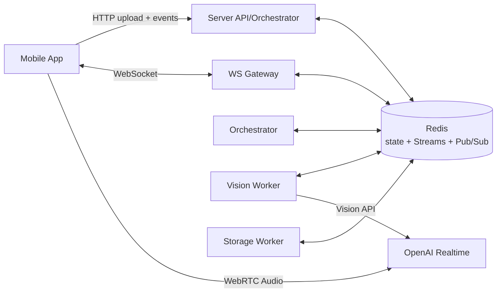
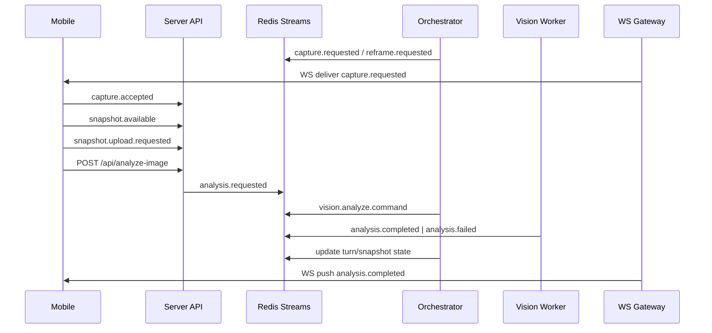
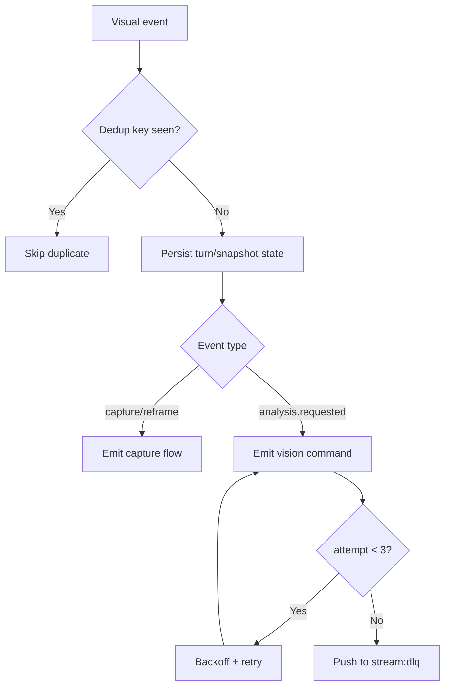

# GardenAI Architecture Notes (Current State)

## 1) Summary
Current model: **hybrid orchestration**.
- Mobile owns camera capture, the local snapshot buffer, and the realtime visual tools.
- Server is the source of truth for turn and snapshot state.
- Realtime audio goes direct-to-OpenAI over WebRTC; the server does not proxy media.
- Redis is the control plane for Pub/Sub, Streams, dedupe, and TTL-bound state.
- WebSocket delivers session updates back to the client.
- Visual events use `schemaVersion: 2.0`.
- Legacy visual aliases are routed through the unified analyze path during the transition.

## 2) Backend Subsystems

### API/Orchestration Service (`server/index.js`)
Ответственность:
- `GET /api/realtime-token` — mint ephemeral token through Azure OpenAI.
- `POST /api/analyze-image` — multipart upload, validation, and visual-flow entrypoint.
- `POST /api/events` — canonical event ingest with dedupe.
- WebSocket gateway — session fanout for statuses and results.

### Orchestrator Service
Ответственность:
- Reads Redis Streams and maintains session state.
- Correlates audio/text/image events through `sessionId`, `causationId`, and `correlationId`.
- Publishes `vision.analyze.command` and handles retry/backoff.
- Decides when to request a reshoot or reframe.

### Vision Worker (`server/workers/vision`)
Ответственность:
- Reads `vision.analyze.command`.
- Calls OpenAI Vision.
- Normalizes results into `analysis.completed`.
- Publishes `analysis.failed` and DLQ entries after retries are exhausted.

### Storage/Retention Worker
Ответственность:
- Trims Redis streams and TTL-bound artifacts.
- Cleans expired event metadata and image artifacts.

### Redis (Bus + Reliability)
- Pub/Sub: low-latency fanout for live notifications.
- Streams: reliable task processing and replay.
- Consumer groups: worker scaling without event loss.

## 3) Event Contracts and Channels

### 3.1 Canonical Event Envelope
```json
{
  "messageId": "uuid-v7",
  "type": "capture.requested",
  "sessionId": "s_123",
  "correlationId": "corr_abc",
  "causationId": "msg_prev",
  "turnId": "turn_123",
  "snapshotId": "snap_123",
  "tsWallIso": "2026-04-06T10:30:12.123Z",
  "schemaVersion": "2.0",
  "payload": {}
}
```

### 3.2 Redis Topology (MVP)
- Streams:
  - `stream:session-events` — входящие доменные события.
  - `stream:vision-commands` — команды vision worker.
  - `stream:analysis-results` — результаты/ошибки анализа.
  - `stream:dlq` — неуспешные после retry.
- Pub/Sub channels:
  - `chan:session:{sessionId}` — push статусов в WS gateway.
  - `chan:ops:alerts` — технические алерты.

### 3.3 Core Event Types
- From mobile/API:
  - `capture.requested`
  - `capture.accepted`
  - `capture.rejected`
  - `snapshot.available`
  - `snapshot.upload.requested`
  - `snapshot.uploaded`
  - `analysis.requested`
  - `reframe.requested`
  - `user.intent.detected`
- Internal commands:
  - `vision.analyze.command`
  - `storage.persist.command`
- Results:
  - `analysis.completed`
  - `analysis.failed`
  - `assistant.visual_guidance`
  - `assistant.prompt`
- Reliability:
  - `event.acknowledged`
  - `event.dead_lettered`

### 3.4 Idempotency and Retry Policy
- Dedup key: `messageId` (Redis SET с TTL 24h).
- Retry: exponential backoff `300ms, 1s, 2.5s`.
- Max attempts: `3`, потом в `stream:dlq`.
- Side effects (вызовы внешнего API) только после idempotency check.

## 4) API Contracts (Public)

### `GET /api/realtime-token`
Response:
```json
{
  "token": "ephemeral_xxx",
  "expiresIn": 60,
  "sessionId": "s_123"
}
```

### `POST /api/analyze-image` (multipart: `image`)
Response:
```json
{
  "imageId": "img_001",
  "species": "Tomato",
  "confidence": 0.87,
  "diagnoses": ["possible early blight"],
  "suggestions": ["remove affected leaves", "avoid overhead watering"],
  "urgency": "medium",
  "disclaimer": "Это не медицинская/агрономическая экспертиза."
}
```

### `POST /api/events`
- Принимает canonical envelope.
- Возвращает `202 Accepted` + `messageId`.

### `WS /ws?sessionId=...`
Сервер пушит:
- `analysis.progress`
- `analysis.completed`
- `analysis.failed`
- `assistant.prompt`
- `assistant.visual_guidance`

## 5) Mermaid Diagrams

### 5.1 Component Diagram


### 5.2 Sequence: Image Analysis Orchestration


### 5.3 Event Reliability Flow


## 6) Test Scenarios (Acceptance)

1. `realtime-token` не раскрывает `OPENAI_API_KEY`, возвращает короткоживущий токен и `sessionId`.
2. `analyze-image` принимает валидный JPEG/PNG и возвращает schema-compliant JSON.
3. Duplicate visual events do not create duplicate capture or reframe side effects.
4. If the vision worker fails, the event retries and lands in `dlq` after 3 attempts.
5. The WS client receives `analysis.completed` for its `sessionId`.
6. Stream and artifact cleanup removes data older than the configured retention window.
7. Server tests remain green (`40/40`); mobile still relies on manual verification.

## 7) Assumptions (Locked)
- MVP has no server-side media proxy for realtime audio.
- Backend orchestration is the primary control plane.
- Redis is available as a managed service or container.
- MVP load is moderate concurrency with vertical scaling at the start.
- Timestamps are UTC (`ISO-8601`) and wall-clock time is used for cross-service logging.
